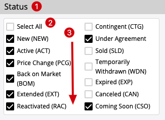

TypeScript React Multi-Check
============================

## Component:

To implement a partial controlled "multiple check" component.

You can pass some options/values and/or other props to construct a multiple columns checkboxes component for user to select one or multiple options. There is a special built-in "Select All" checkbox to help to check/uncheck all the options for convenient, and it should always have the correct checking state.

It's "Partial-controlled", which means when options/values are provided, they are treated as the current default options/values for rendering. Users are able to operate on the component, to change or pass back the new checking state. If the passing options/values are changed, they will be treated as the new default state to render and the previous internal state will be discarded.



1. The component has a label
2. The special `Select All` option
   1. if checked, all other options are checked
   2. if unchecked, all other options are unchecked
   3. if all other options are checked, it should be checked
   4. if any other option are unchecked, it should be unchecked
   5. NOTE: there behavior always work even if 'values' or 'onChange' not passed to the component or is `undefined`
3. The options support multiple-columns, and the direction is from top to bottom in each column

### The layout example

Suppose

```
options =  ['aaa', 'bbb', 'ccc', 'ddd', 'eee', 'fff'] 
columns = 3
```

There are several possibilities:

1. not preferred
```
Select All   ccc      fff
aaa          ddd
bbb          eee
```

2. preferred
```
Select All   ccc       eee
aaa          ddd       fff
bbb           
```

Make the column sizes as even as possible, and put extra options in the first several columns, and also make them even,
so the 2nd solution is preferred.

### About the 'Controller'

There is already a Controller component exists in repo, which is a demo helper to help you verify your component behaviour.

When you're developing the `MultiCheck` component, you can click on the buttons of 'Controller' to make sure it's working.


### Performance requirement

You can add proper react hooks in the component to avoid unnecessary component-level renders if no real state changes

## Dev

```
npm install
npm run dev
```

## Test

```
npm test
```
